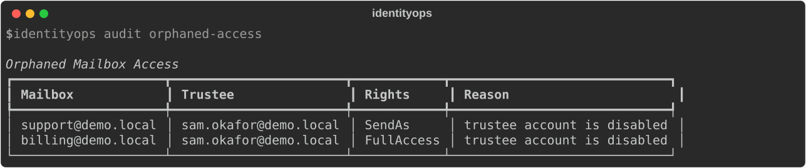
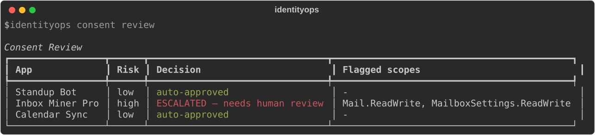
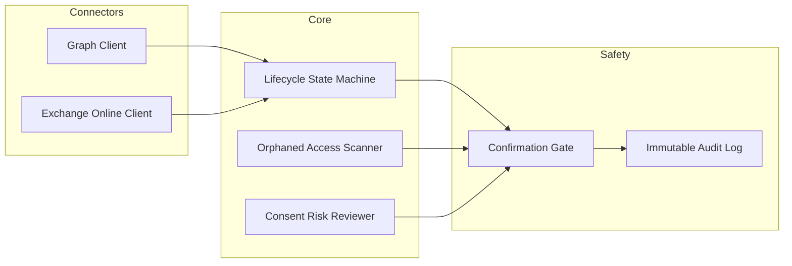

# IdentityOps

**Automated identity lifecycle management for Microsoft 365 — with the governance and safety layer most tools skip.**

Every IT team automates onboarding. Fewer automate offboarding *correctly*. Almost none catch the access that group-based automation quietly leaves behind: a direct mailbox delegation, a Send-As grant, an OAuth app nobody remembers approving. IdentityOps is built around a simple premise — **identity automation without a governance layer isn't automation, it's a liability with a nice UI.**

This is a reference implementation of how I'd design that layer: explicit state machines instead of fire-and-forget scripts, risk-scored consent review instead of rubber-stamped approvals, and a confirmation gate that makes destructive actions structurally hard to run by accident.

## The problem, concretely

- A user leaves. Their security groups get cleaned up. Six months later someone discovers they still have Send-As access on three shared mailboxes, granted individually and never touched by the offboarding process, because group removal and direct permission grants are two entirely different Graph/EXO APIs that most tooling treats as one.
- A new SaaS app requests OAuth consent. It asks for `Mail.ReadWrite` — write access to every mailbox in the tenant. It gets rubber-stamped because reviewing scopes by hand doesn't scale past the fifth request of the week.
- An offboarding script runs, someone fat-fingers the wrong user ID, and there's no dry-run, no diff, no second confirmation standing between a typo and a deleted account.

IdentityOps exists to make all three of those structurally harder to happen.

## See it in action





Both screenshots are real captured CLI output (via `rich`'s SVG export, see `scripts/generate_screenshots.py`) against the built-in demo tenant — not mockups.

## Architecture



Every write operation flows through the same safety gate, regardless of which connector or workflow triggered it. There's no code path that mutates a tenant without passing through `safety/confirmation_gate.py` and landing in the audit log.

## Features

- **Full joiner-mover-leaver lifecycle** — staged offboarding through an explicit state machine (`pending → blocked → forwarding → scheduled_delete → deleted`), not immediate destruction
- **Orphaned access detection** — scans every shared mailbox for individually-granted FullAccess/Send-As permissions held by disabled or deleted users. This is the gap that catches most orgs off guard, and most tools don't check for it at all
- **Risk-scored consent governance** — evaluates OAuth scope requests against a declarative risk ruleset, auto-approves low-risk read scopes, escalates anything touching mail/files/directory write access
- **Confirmation-gated destructive actions** — every mutating action defaults to a dry run and requires an explicit `--confirm` to execute, logged either way
- **Immutable audit log** — every action recorded with before/after state, not just a pass/fail line

## Quickstart (no real tenant required)

```bash
git clone https://github.com/Devin19910/identityops.git
cd identityops
docker-compose up
# then: curl http://localhost:8000/audit/orphaned-access
```

Or run the CLI directly against the built-in synthetic demo tenant:

```bash
pip install -e .

identityops audit orphaned-access                     # dry run: shows findings only
identityops audit orphaned-access --remediate --confirm  # actually removes the flagged permissions

identityops consent review                            # low-risk apps auto-approve, risky ones get flagged
identityops consent review --confirm                   # actually grant the auto-approved ones

identityops offboard sam.okafor@demo.local             # dry run
identityops offboard sam.okafor@demo.local --confirm   # actually block sign-in + revoke sessions
```

The demo tenant has two findings planted on purpose — a disabled user (`sam.okafor@demo.local`) who still holds Send-As/FullAccess on two shared mailboxes — so the scanner has something real to catch on first run.

## Tech stack

Python · FastAPI · Typer · Microsoft Graph · Exchange Online REST · Docker

## Why I built this

The orphaned-mailbox scanner specifically comes from a real incident: a departed contractor still holding Send-As access on eight shared mailboxes weeks after his group memberships were cleaned up, caught only because someone happened to ask. This project is that fix, generalized and rebuilt from scratch as a standalone, tenant-agnostic tool.

## Wiring up a real tenant

The `GraphConnector` and `ExoConnector` implementations are real, working app-only auth clients — they're just not wired into the CLI by default, so nobody can point this at a live tenant by accident. See `docs/architecture.md` for what's needed to connect them.

## Roadmap

- [ ] Slack/Teams notification hooks for governance escalations
- [ ] Pluggable risk-rule DSL (YAML-defined scope policies instead of hardcoded rules)
- [ ] Okta connector, to prove the abstraction actually holds

## License

MIT
